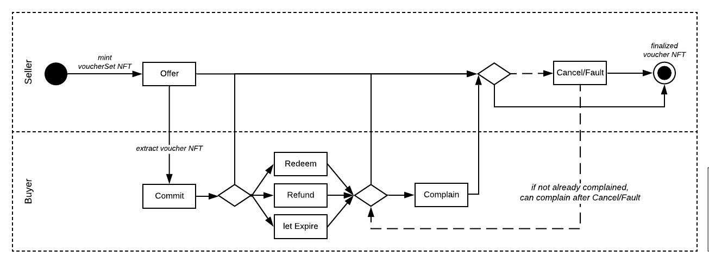

# Smart contracts description

This is a brief description of the smart contracts used in Boson Protocol. They 
are based on two NFT standards, 
[ERC-1155](https://eips.ethereum.org/EIPS/eip-1155) and 
[ERC-721](https://eips.ethereum.org/EIPS/eip-721).  

Main contracts:  
* BosonToken: ERC-20 contract for the native Boson Protocol token  
* Cashier: funds-related functions  
* ERC1155ERC721: token factory  
* VoucherKernel: main business logic  
* usingHelpers: common utils as structures  

Supported currencies are currently ETH and BSN tokens therefore functions 
dealing with funds have appendices such as ETH_ETH or ETH_TKN to denote the 
currencies used in that particular function (e.g. 
`function requestCreateOrder_ETH_ETH(uint256[] calldata metadata)`).  

## Transactions flow

The journey through the NFT lifecycle is presented on a simplified diagram 
below.  

  

Voucher's status is defined in 7 bits that are set depending on the path in its 
lifecycle (defined in 
[usingHelpers.sol](https://github.com/bosonprotocol/bsn-core-prototype/blob/master/contracts/usingHelpers.sol#L29)):  

7:COMMITTED  
6:REDEEMED  
5:REFUNDED   
4:EXPIRED  
3:COMPLAINED  
2:CANCELORFAULT  
1:FINAL  

### Happy path

The process starts with Seller making an offer - minting a VoucherSet, which is 
represented as ERC-1155 token: `Cashier.requestCreateOrder()`. The Seller sets 
the expiration period of the whole VoucherSet.  

Then the Buyer purchases the Voucher, i.e. is committing to redeem it at some 
point later - this means an ERC-721 token is extracted from a VoucherSet: 
`Cashier.requestVoucher()`.  

The Buyer redeems the voucher, thus releasing the payment amount to the Seller: 
`VoucherKernel.redeem()`.  

After the two wait periods pass (the period within which Buyer can complain and 
the period within which Seller can admit cancel/fault), the Seller's deposit 
can be returned to the Seller and Buyer's deposit can be returned to the Buyer.  

A scheduled process is running in the backend that flags the vouchers when 
redemption was made and when wait periods expire. Anybody could be executing 
these functions, marked as external, the backend is currently running them for 
convenience: `VoucherKernel.triggerExpiration()`, 
`VoucherKernel.triggerFinalizeVoucher()`, `Cashier.withdraw()`.  
