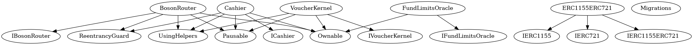
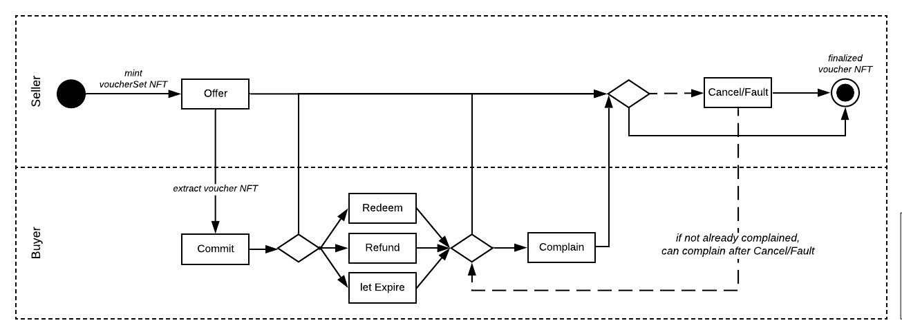

# Smart Contracts - Overview

This is a brief description of the smart contracts used in Boson Protocol. They 
are based on two NFT standards, 
[ERC-1155](https://eips.ethereum.org/EIPS/eip-1155) and 
[ERC-721](https://eips.ethereum.org/EIPS/eip-721).  

> Note: Seller makes an offer by minting an ERC-1155 Voucher Set that holds a supply of specified quantity of assets. Buyer taking that offer is implying that a singleton Voucher will be extracted from the originating Voucher Set, thus minting an ERC-721.  

## Contracts description
Main contracts:  
* BosonRouter: user interface of Boson Protocol  
* Cashier: escrow and funds management  
* ERC1155ERC721: token factory  
* FundLimitsOracle: restrictions on the allowed escrowed amounts  
* VoucherKernel: main business logic  
* UsingHelpers: common utilities  

  
Control graph of contracts is [available here](../assets/bosonprotocol-graph.png) 

There are three types of funds in Boson Protocol, one for the payment and two security deposits:  
* price of the asset  
* Seller's deposit  
* Buyer's deposit  

Supported **currencies** are currently: ETH and $BOSON tokens.
> Note: Functions dealing with funds have appendices such as ETHETH or ETHTKN to denote the currencies used in that particular function. Two examples below.  
ETH as the payment currenct and ETH as the deposits currency example:  
`function requestCreateOrderETHETH(uint256[] calldata metadata)`  
$BOSON token ("TKN") as the payment currenct and ETH as the deposits currency example:  
`function requestCreateOrderTKNETH(uint256[] calldata metadata)`  

## Transaction flow

The journey through the NFT lifecycle is presented on a simplified diagram 
below.  

  

### Wait periods  
A detailed game tree is [available here](../assets/exchange-diagram.png), where three different wait periods are also visible:  
* voucher's validity period - start and end date when the voucher can be redeemed  
* complain period - during which Buyer can complain  
* cancelOrFault period - during which Seller can issue a cancel-or-fault transaction

Validity period is set by the Seller when creating an offer. Complain and cancelOrFault periods are global for the whole Boson Protocol in VoucherKernel.  

### Voucher lifecycle  
Voucher's status is defined in 7 bits that are set depending on the path in its 
lifecycle (defined in 
[UsingHelpers.sol](https://github.com/bosonprotocol/bsn-core-prototype/blob/master/contracts/UsingHelpers.sol#L47)):  

7:COMMITTED  
6:REDEEMED  
5:REFUNDED   
4:EXPIRED  
3:COMPLAINED  
2:CANCELORFAULT  
1:FINAL  

There are few additional, technical flags, as well, to record the status of the funds of a particular vouchers and to record the timestamps of wait periods triggering.  

### Happy path

The process starts with Seller making an offer - minting a VoucherSet, which is 
represented as ERC-1155 token: `BosonRouter.requestCreateOrder()`. The Seller sets 
the expiration period of the whole VoucherSet.  

Then the Buyer purchases the Voucher, i.e. is committing to redeem it at some 
point later - this means an ERC-721 token is extracted from a VoucherSet: 
`BosonRouter.requestVoucher()`.  

The Buyer redeems the voucher, thus releasing the payment amount to the Seller: 
`VoucherKernel.redeem()`.  

After the two wait periods pass (the period within which Buyer can complain and 
the period within which Seller can admit cancel/fault), the Seller's deposit 
can be returned to the Seller and Buyer's deposit can be returned to the Buyer.  

A scheduled process is running in the backend that flags the vouchers when 
redemption was made and when wait periods expire. Anybody could be executing 
these functions, marked as external, the backend is currently running them for 
convenience: `VoucherKernel.triggerExpiration()`, 
`VoucherKernel.triggerFinalizeVoucher()`, `Cashier.withdraw()`.  
