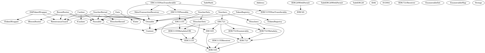

# Smart Contracts - Overview

This is a brief description of the smart contracts used in Boson Protocol. They 
are based on two NFT standards, 
[ERC-1155](https://eips.ethereum.org/EIPS/eip-1155) and 
[ERC-721](https://eips.ethereum.org/EIPS/eip-721).  

> Note: Seller makes an offer by minting an ERC-1155 Voucher Set that holds a 
> supply of a specified quantity of assets. A Buyer taking the offer is implying 
> that a singleton Voucher will be extracted from the originating Voucher Set, 
> thus minting an ERC-721.

## Contracts description

Main contracts:  
* `BosonRouter`: User interface of Boson Protocol  
* `Cashier`: Escrow and funds management  
* `VoucherSets`: VoucherSets token contract. Conforms to the ERC1155 standard.
* `Vouchers`: Vouchers token contract. Conforms to the ERC721 standard
* `TokenRegistry`: Restrictions on the allowed escrowed amounts and registry of token wrappers
* `VoucherKernel`: Main business logic  
* `UsingHelpers`: Common utilities
* `DAITokenWrapper`: Provides a uniform interface for calling the `permit `function on the DAI token
* `ERC1155NonTransferable`: Non-transferrable token, the possession of which allows a buyer to commit to an item following a special quest or campaign.
* `Gate`: Allows users of the protocol to gate access to a given VoucherSet by requiring that any address attempting to commit to an item in the given VoucherSet have a given ERC1155 before they access.
* `MetaTransactionReceiver`: Base contract that allows the ERC1155NonTransferable contract to receive and proces meta transactions

  
A control graph of the contracts is 
[available here](../assets/bosonprotocol-graph.png). 

There are ***three types of funds*** in Boson Protocol, one for the payment and 
two for security deposits:  
* The price of the asset  
* The Seller's deposit  
* The Buyer's deposit  

Supported **currencies** are currently: ETH, $BOSON token and DAI.
> Note: Functions dealing with funds have suffixes such as ETHETH or ETHTKN to 
> denote the currencies used in that particular function. Two examples are given 
> below.  

ETH as the payment currency and ETH as the deposit currency example:  
```solidity
function requestCreateOrderETHETH(uint256[] calldata metadata)
```

$BOSON token ("TKN") as the payment currency and ETH as the deposit currency 
example:  
```solidity
function requestCreateOrderTKNETH(uint256[] calldata metadata)
```

## Exchange mechanism  

The journey through the NFT lifecycle is presented on a simplified diagram 
below.  

  

A detailed game tree is [available here](../assets/exchange-diagram.png), 
showcasing the actions that Sellers and Buyers can make. The order of some of 
these transactions is not prescribed, e.g. a Seller can do a CancelOrFault 
transaction independently of any Buyer action.  

> Note: while the current exchange mechanism is in our opinion quite robust, it 
> is by no means set in stone, rather it will be evolving in the future. We are 
> already working on some improvements and are actively pursuing research in 
> this area.  

### Process

1. The process starts when the Seller makes an offer to sell something. He is 
   making a promise to execute the exchange of his non-monetary asset for a 
   monetary asset of a Buyer at a later point in time. He has some skin in the 
   game, pressuring him to deliver what was promised, as a Seller's deposit. 
   The offer can be for an arbitrary amount of items, thus the Seller specifies 
   the quantity of available things that all bear similar properties, we say 
   such an offer is a Voucher Set.  

   Example:

```solidity
BosonRouter.requestCreateOrderETHETH()  
```
   
   Alternatively, the Seller can make an offer with an associated gate contract and
   non-transferrable NFT Id. In this case, the Seller is making the item(s) on offer
   only available to Buyers who execute a conditional commit. The "condition" of
   the commit is possession of a non-transferrable NFT with the given Id. A Buyer
   can obtain the NFT by, for instance, completing a quest. The Seller might make items
   obtained via conditional commit available for a discount as a reward to Buyers for
   completing the quest.

   Example:

```solidity
BosonRouter.requestCreateOrderETHETHConditional(()  
```

> Note: the contracts currently refer to this Voucher Set using a few different
> terms such as offer, listing, supply. We are in the process of consolidating
> these terms so for the sake of clarity, making an offer is equivalent to 
> creating a Voucher Set which is in turn equivalent to minting an ERC-1155 NFT.


2. The Buyer discovers the offer and decides to purchase a single Voucher. 
   In doing so, she commits to redeem that voucher in the future by putting the 
   Buyer's amount of security deposit in escrow, alongside the payment amount.

> Note: committing to buy a voucher is equivalent to creating a Voucher from a 
> Voucher Set which is equivalent to minting an ERC-721 NFT out of the parent 
> ERC-1155.

   Example:
  
```solidity
BosonRouter.requestVoucherETHETH()  
```

   Alternatively, if the Buyer is in possession of a specific non-transferrable NFT
   (specified by Seller when offer is made), she would be eligible for a special 
   price or other offer when she commits to redeem the voucher. The Buyer could obtain
   the NFT by, for instance, completing a quest. The protocol checks to see if the user
   owns the NFT (and is therefore eligible for the special offer) at commitment time.

   Example:

```solidity
BosonRouter.requestVoucherETHETH()  
```


3. The Buyer can then choose to `redeem` the voucher and exchange the payment 
   amount for the item received, or can choose to `refund` the voucher, thus 
   getting the payment back, but also potentially losing the deposit, or can 
   choose not to do anything (she can just forget about it), in which case the 
   voucher `expires`.

```solidity
BosonRouter.redeem() // or BosonRouter.refund() or wait till background service 
                     // calls VoucherKernel.triggerExpiration()  
```

4. The Buyer can then `complain`, signaling dissatisfaction of the promise 
   execution. In doing so, the Seller get penalized.
     
```solidity
BosonRouter.complain()  
```

5. The Seller can at any time, independently of the Buyer, issue a 
   `cancelOrFault` transaction, which can cancel the current offer and/or admit 
   fault in a quality delivery, thus admitting part of his deposit to be sent to 
   the Buyer as a recourse.  

```solidity
BosonRouter.cancelOrFault()  
```

6. Wait periods start ticking at various points in the game tree. Once passed, 
   they are marked for each Voucher and ultimately the Voucher is `finalized`,
   meaning neither the Buyer nor the Seller can use it anymore.  

```solidity
BosonRouter.triggerFinalizeVoucher()  
```

7. Finally, funds in escrow are released according to the Voucher's status.   

```solidity
Cashier.withdraw()  
```

### Wait periods
  
There are three different wait periods, also visible in the game tree diagram:  
* the Voucher's validity period: the start and end dates when the voucher can be 
  redeemed  
* the complain period: during which the Buyer can complain  
* the cancelOrFault period: during which the Seller can issue a cancel-or-fault 
  transaction

The validity period is set by the Seller when creating an offer. The complain 
and cancelOrFault periods are global for the whole Boson Protocol in 
the `VoucherKernel` contract.  

### Voucher lifecycle  

A Voucher's status is defined in 7 bits that are set depending on the path in 
its lifecycle (defined in 
[UsingHelpers.sol](https://github.com/bosonprotocol/bsn-core-prototype/blob/master/contracts/UsingHelpers.sol#L47)):  

```
6:COMMITTED  
5:REDEEMED  
4:REFUNDED   
3:EXPIRED  
2:COMPLAINED  
1:CANCELORFAULT  
0:FINAL  
```

There are also a few additional, more technical flags that record the status of 
the funds of a particular voucher and that also record the timestamps of wait 
periods being triggered.  

### Services in the background
  
There are a few functions that can be called by an application built on Boson Protocol to mark vouchers as 
expired or finalized or to wtidhraw funds. These functions can be called on a scheduled basis or as 
individual calls: `VoucherKernel.triggerExpiration()`, 
`VoucherKernel.triggerFinalizeVoucher()`, `Cashier.withdraw()`.  

### Happy path

The process starts with the Seller making an offer - minting a VoucherSet, which 
is represented as an ERC-1155 token: `BosonRouter.requestCreateOrder()`. The 
Seller sets the expiration period of the whole VoucherSet.  

Then the Buyer purchases the Voucher, i.e. is committing to redeem it at some 
point later - this means an ERC-721 token is extracted from a VoucherSet: 
`BosonRouter.requestVoucher()`.  

The Buyer redeems the voucher, thus releasing the payment amount to the Seller: 
`BosonRouter.redeem()`.  

After the two wait periods pass (the period within which the Buyer can complain 
and the period within which the Seller can admit cancel/fault), the Seller's 
deposit can be returned to the Seller and Buyer's deposit can be returned to the 
Buyer.
